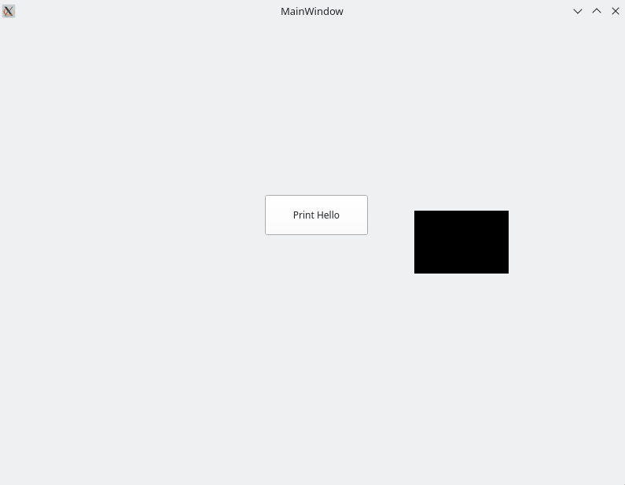
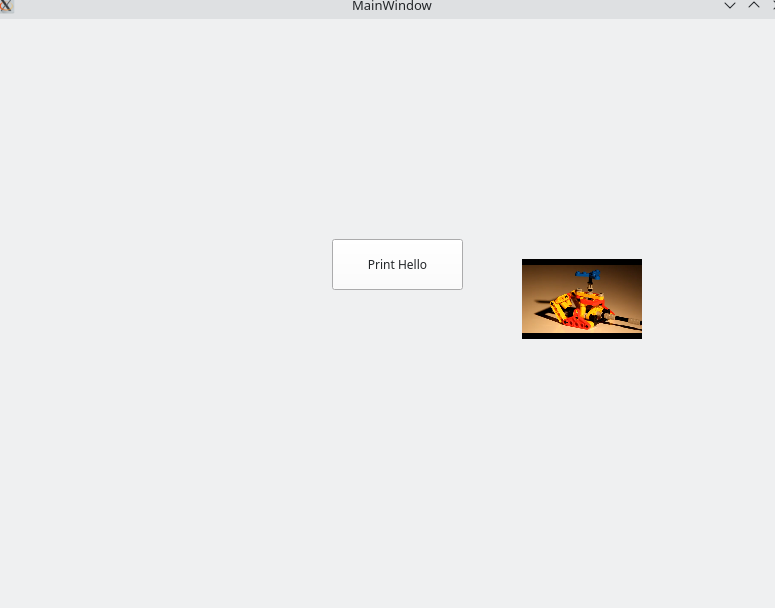

# Intro
I need to get qtbase and qtmultimeida cross compiling to mingw32 for my job. I
want to upstream these changes but sometimes the review process in nixpkgs is taking
longer than I have time for. This repo exists so I can iterate quickly on
getting cross compilation working for nixpkgs and so other memembers of the
community can leverage my work and hopefully help me get a few more packages
cross compiling :)

## Building
```
nix build '.#pkgs.pkgsCross.mingw32.qtbase'
nix build '.#pkgs.pkgsCross.mingw32.qtmultimeida'
```

For `qtapp-example`: 
1. Navigate to `nix/overlays/pkgs/qtapp-example/default.nix`
and change the `installerScriptBuilderOutput` varable to a path where you want
your final windows installer to be placed.
2. Run `nix build '.#pkgs.pkgsCross.mingw32.qtapp-example'`
3. Install [bottles](https://usebottles.com/)
4. Create a new bottle and install [inno setup](https://jrsoftware.org/isdl.php#stable) within the bottle 
5. Run inno setup
6. Goto `file->open` and select the `qtapp-example-installer-builder.iss` that
   was built from running `nix build '.#pkgs.pkgsCross.mingw32.qtapp-example'`
7. Press `build->compile`
8. Navigate to the directory specified in `installerScriptBuilderOutput`. You
   should find the installer named `qtapp-example-installer.exe.exe` 
9. Run the installer in your windows environment

## Expected behavior of qtapp-example
On launch before button is pressed


After button press, a short video of a toy will play


## Status
- qtbase: Working within overlay. Not fully ported to nixpkgs
- qtmultimeida: Working within overlay. Not fully ported to nixpkgs
- qtapp-example: Working within overlay. Utilizes both qtbase and qtmultimeida.
    May never be ported to nixpkgs but serves as a good example of the
    requirments needed to package a windows application that wants to use a
    traditional installer such as inno setup.

## Issue tracking
- https://github.com/NixOS/nixpkgs/issues/274274
- https://github.com/NixOS/nixpkgs/issues/272538

## Recommneded process to upstream to nixpkgs 
1. Clone nixpkgs master branch
2. Try and build qtbase or qtmultimeida within nixpkgs
3. You should get a build error for one of the packages. Use this as the
   starting package to port changes over. Once things are compiling, open a PR
   for that individual package.
